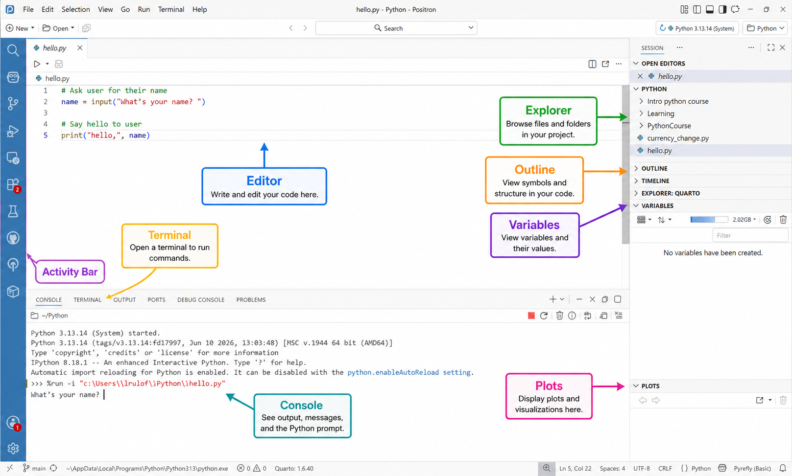

## What is Positron?

Positron is the program we will use to write and run Python code.

Programmers call this kind of program an **IDE**, which stands for **Integrated Development Environment**. That just means it puts the important coding tools in one place:

- an editor for writing code,
- a console for running code and seeing output,
- a terminal for commands,
- a file explorer,
- and panes for variables, plots and other useful information.

You do **not** need to understand every button before you start. For now, focus on the main areas in the picture below.

## The Positron window

The labelled picture shows the parts of Positron you will use most often.

{fig-alt="A labelled screenshot of Positron showing the Editor, Explorer, Outline, Variables, Plots, Console, Terminal and Activity Bar."}

::: {.callout-tip title="Start simple"}

At the beginning, you mostly need three things:

1. **Editor** — where you write code.
2. **Console** — where you see output and prompts.
3. **Explorer** — where you find your files.
:::

## Editor

The **Editor** is where you write and change your code.

In the picture, the editor contains a file called `hello.py`.

```python
# Ask user for their name
name = input("What's your name? ")

# Say hello to user
print("hello,", name)
```

The line numbers on the left help you find your place. When Python gives an error, it often tells you the line number where the problem happened.

Use the editor when you want to write a program that you will save and run again later.

## Explorer

The **Explorer** shows the files and folders in your project.

You can use it to:

- open a file,
- create a new file,
- rename a file,
- organise your code into folders,
- and check that you are working in the correct project.

For this course, your Python files might look something like this:

```text
PythonCourseWork/
├── lesson1.py
├── lesson2.py
├── games/
└── experiments/
```

::: {.callout-note title="File names matter"}

Use clear file names such as `lesson1.py`, `guessing_game.py` or `quiz.py`.

Avoid names like `new file.py`, `test2.py`, or `final_final_real.py`.
:::

## Console

The **Console** is where Python talks back to you.

It can show:

- output from your program,
- messages from Python,
- questions created by `input()`,
- and error messages.

In the picture, the program is asking:

```text
What's your name?
```

That question appears because the code uses:

```python
name = input("What's your name? ")
```

When Python asks a question in the console, type your answer there and press **Enter**.

## Terminal

The **Terminal** is used for commands.

For example, you can run a Python file by typing:

```bash
python hello.py
```

or, on some Windows computers:

```bash
py hello.py
```

The terminal is also useful later for installing packages, rendering the Quarto course, or using Git.

For now, do not worry if the terminal feels strange. You will mainly use it when the lesson tells you exactly what to type.

## Variables

The **Variables** pane shows objects that currently exist in your Python session.

For example, after running:

```python
name = "Alex"
score = 10
```

the Variables pane may show something like:

```text
name     "Alex"
score    10
```

This is useful because you can check what Python remembers.

If the Variables pane says:

```text
No variables have been created.
```

that just means you have not yet run code that creates variables in the current session.

## Plots

The **Plots** pane displays graphs and visualisations.

You will use this more later when you start working with data.

For example, a Python program can create a graph, and Positron can show it in the Plots pane.

## Outline

The **Outline** pane shows the structure of the file you are editing.

For a Python file, it may show functions or important symbols.

For a Quarto lesson file, it can show headings like:

- Learning goals
- Exercises
- Hints
- Solutions

This is useful when a file becomes long and you want to jump to a section quickly.

## Activity Bar

The **Activity Bar** is the vertical strip of icons on the side of Positron.

It lets you switch between major views, such as:

- search,
- source control,
- extensions,
- and other tools.

You do not need to use it much at the start. The most useful icon early on is the one that opens the Explorer.

## Running your first program

Create a new file called:

```text
hello.py
```

Type this code into the editor:

```python
name = input("What's your name? ")

print("Hello,", name)
```

Save the file.

Then run it. Positron should ask your name in the console.

Type your name and press **Enter**.

You should see something like:

```text
What's your name? Alex
Hello, Alex
```

## Useful keyboard shortcuts

| Shortcut | What it does |
|---|---|
| `Ctrl + S` | Save the current file |
| `Ctrl + Z` | Undo |
| `Ctrl + Shift + P` | Open the Command Palette |
| <kbd>Ctrl</kbd> + <kbd>`</kbd> | Open or close the Terminal |
| `Ctrl + /` | Comment or uncomment selected lines |

## Mini practice

Try these small tasks before starting Lesson 1.

### Task 1

Open the Explorer and create a new file called:

```text
practice.py
```

### Task 2

Type this into the editor:

```python
print("I am learning Python in Positron.")
```

Run the file.

### Task 3

Change the message and run the file again.

### Task 4

Create a variable:

```python
score = 10
```

Run the code and check whether you can see `score` in the Variables pane.

<details>
<summary>Click to reveal help</summary>

If you cannot see a variable, try running the file again.

Also check that you are using the Python session selected at the top right of Positron.

</details>

## Good habits

- Save your work often.
- Keep your files in the right folder.
- Give files meaningful names.
- Read error messages slowly.
- Change one thing at a time when fixing a problem.
- Try things yourself before asking for the solution.

## Ready for Lesson 1

Once you can find the Editor, Console and Explorer, you are ready to begin Lesson 1.


# Looking ahead

After you are comfortable moving around Positron, you're ready to begin Lesson 1 and write your first Python program.
